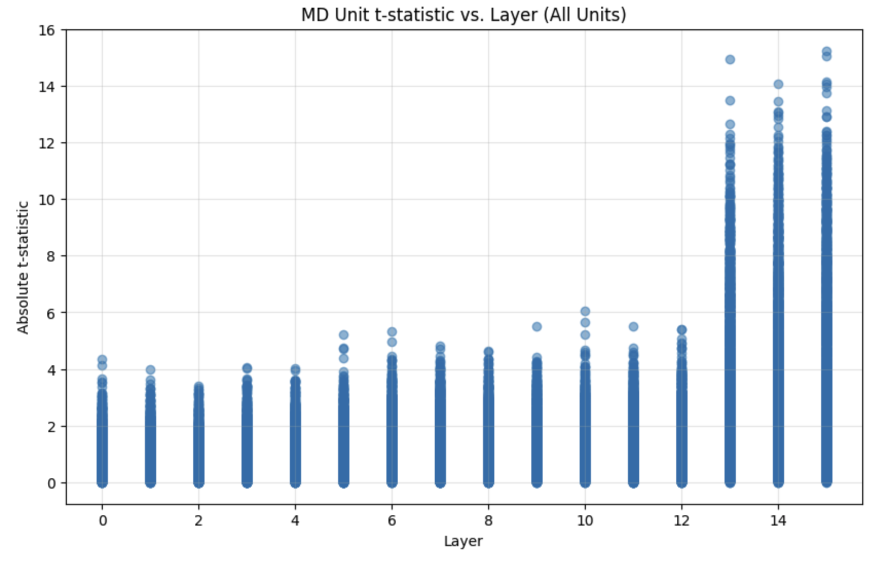
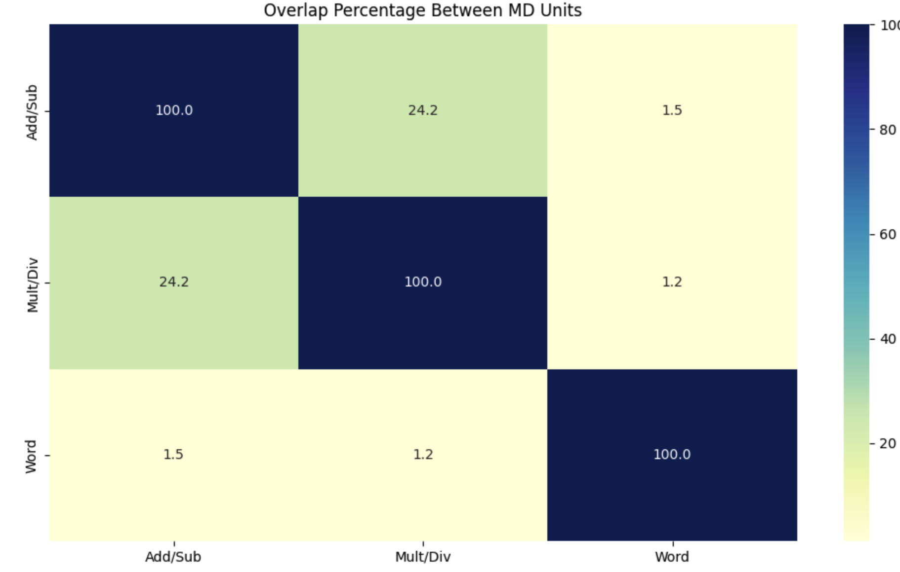

### Data Generation and Model Accurcay
* Addition & Subtraction (Main):
    * 400 in total (200 addition, 200 subtraction)
    * Types of error injected into incorrect answers: small numeric offest ((±1 to ±10)), digith sawps (e.g. 582 → 528); Operation inversion (e.g. using subtraction for addition problems); Larger random errors (±11 to ±50)
    * We tested the confidence of the model in correct and incorrect prompt, and the model achieve almost 100% accuracy        
    * Example Entry: 
        ```json
        {
        "type": "addition",
        "problem": "134 + 448",
        "correct_equation": "134 + 448 = 582",
        "incorrect_equation": "134 + 448 = 528",
        "a": 134,
        "b": 448,
        "correct_answer": 582,
        "incorrect_answer": 528
        }
        ```
* Multiplication & Division :
    * 400 in total (200 Multiplication, 200 Division)
    * Models also perform well on this with near 100% accuracy
    * Example Entry: 
        ```json
          {
            "type": "multiplication",
            "problem": "11 \u00d7 10",
            "correct_equation": "11 \u00d7 10 = 110",
            "incorrect_equation": "11 \u00d7 10 = 90",
            "a": 11,
            "b": 10,
            "correct_answer": 110,
            "incorrect_answer": 90
        }
        ``` 
* Addition & Subtraction in words :
    * 400 in total (200 Multiplication, 200 Division)
    * Model doesn't perform very well
    * Example Entry: 
        ```json
            {
            "type": "subtraction",
            "problem": "Ethan had nineteen stamps. After giving some to Henry, Ethan had five stamps left. How many stamps did Ethan give to Henry?",
            "correct_statement": "Ethan gave five stamps to Henry.",
            "incorrect_statement": "Ethan gave thirty-three stamps to Henry.",
            "num_total": 19,
            "num2": 14,
            "correct_answer": 5,
            "incorrect_answer": 33
        }
        ``` 


### MD Units 
Methodology

* Identified MD units by comparing activations in correct vs. incorrect arithmetic solutions
* Captured MLP down projection activations across all transformer layers
* Applied paired t-tests to measure activation differences
Selected top 1% of units with highest absolute t-statistic values

Example Findings on Llama-3.2-1B:

```
Top 1% Units Distribution:

Layer 13: 66 units (20.18%)
Layer 14: 107 units (32.72%)
Layer 15: 154 units (47.09%)
```



### Ablation

1. **Lesoning:** I tried zeroing out the top 1% (and top n%) of units, using both direct zeroing during inference and internal masking. However, these methods did not produce the expected effects.
2. **Generalizing:** I tested the model on multiplication and division tasks, as well as on addition and subtraction problems expressed in natural language.
* As shown here, addition and subtraction share a portion of units with multiplication and division. However, when addition and subtraction are described in natural language, the unit sharing appears to be very limited.

    
